# Diagrams and Documentation Best Practices

## Overview
Documentation diagrams are essential for communicating system architecture, data flows, and project structures. This guide covers ERD, UML, Mermaid, and other diagramming techniques.

## Documentation Tools
- [Mermaid Documentation](https://mermaid.js.org)
- [PlantUML Documentation](https://plantuml.com)
- [Draw.io](https://app.diagrams.net)
- [Lucidchart](https://www.lucidchart.com)
- [dbdiagram.io](https://dbdiagram.io)

## Mermaid Diagrams

### Flowchart

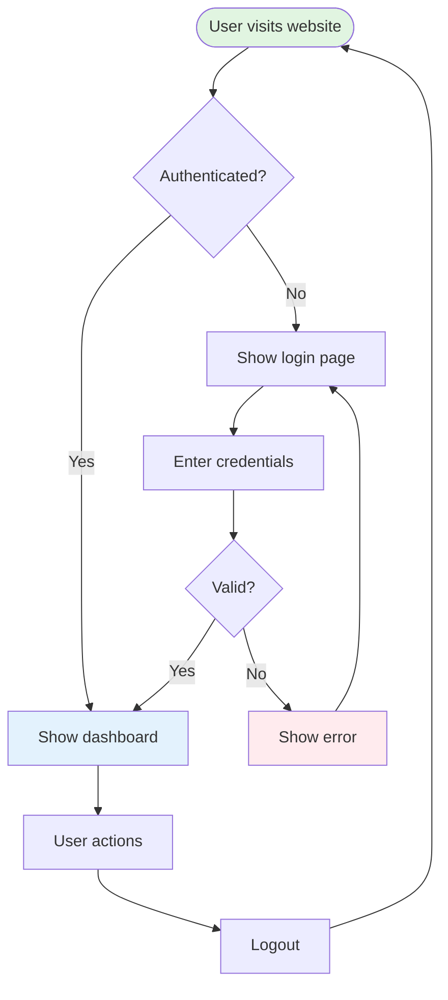

### Sequence Diagram

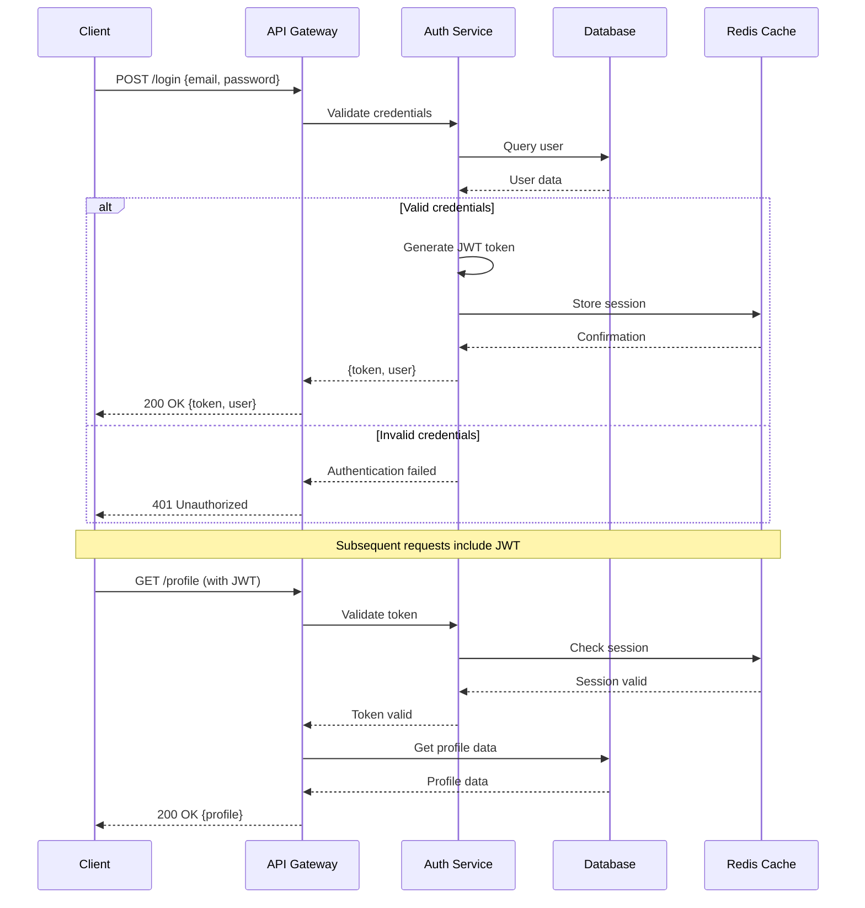

### Class Diagram

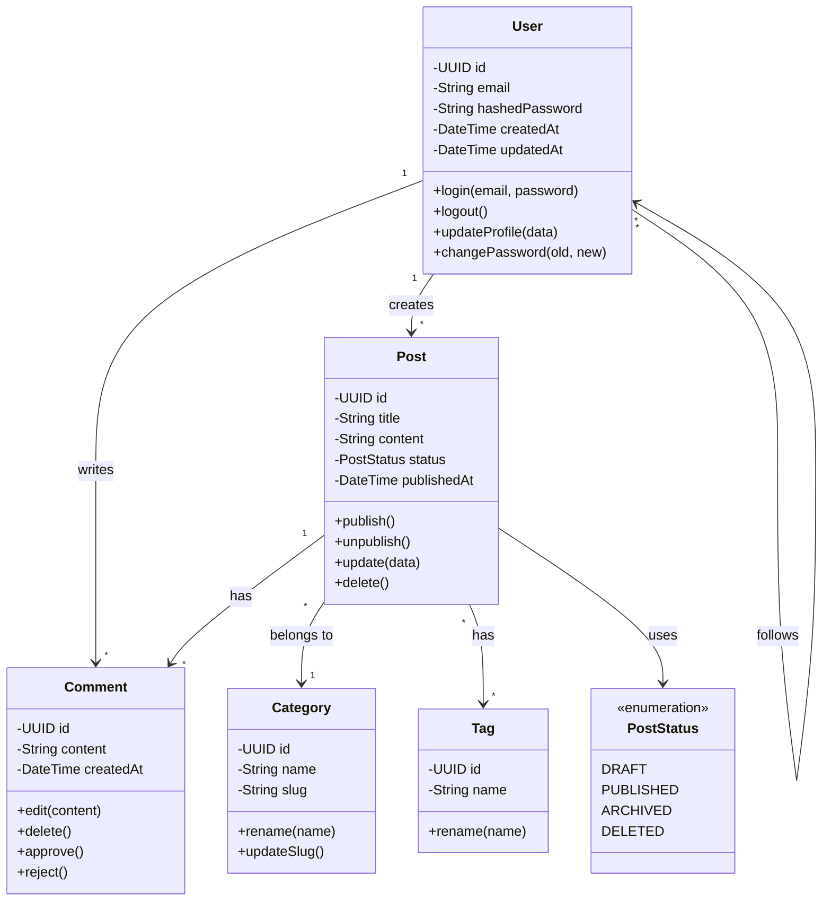

### State Diagram

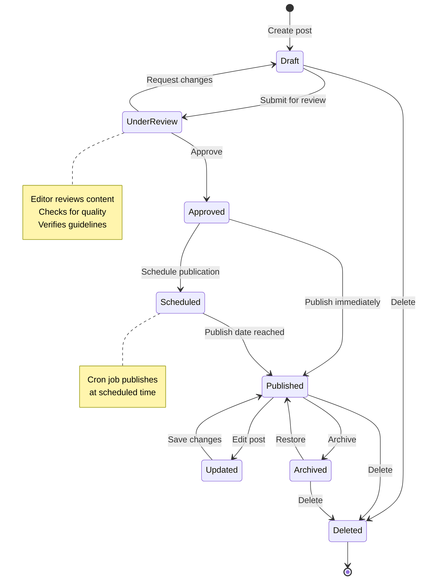

### Entity Relationship Diagram (ERD)

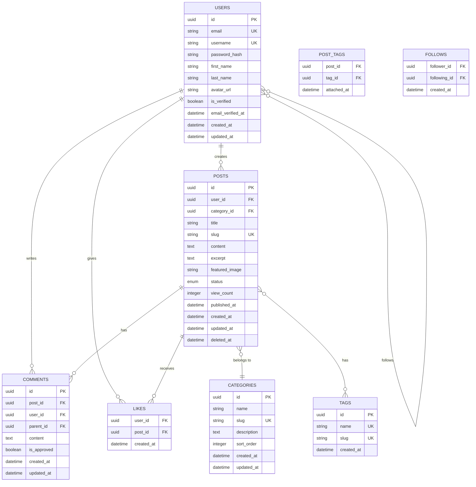

### Gantt Chart

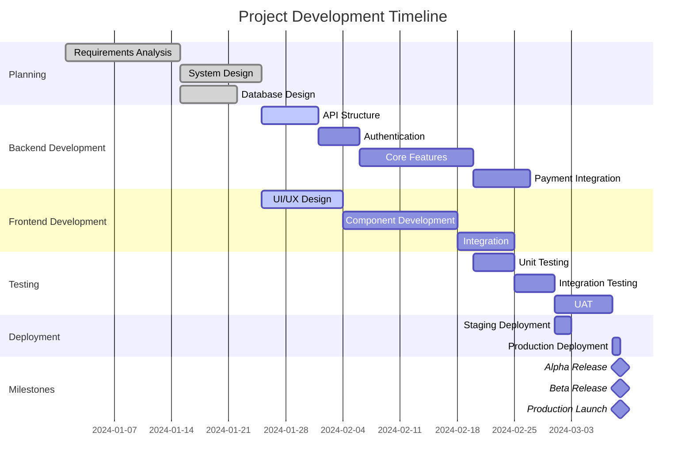

### Pie Chart

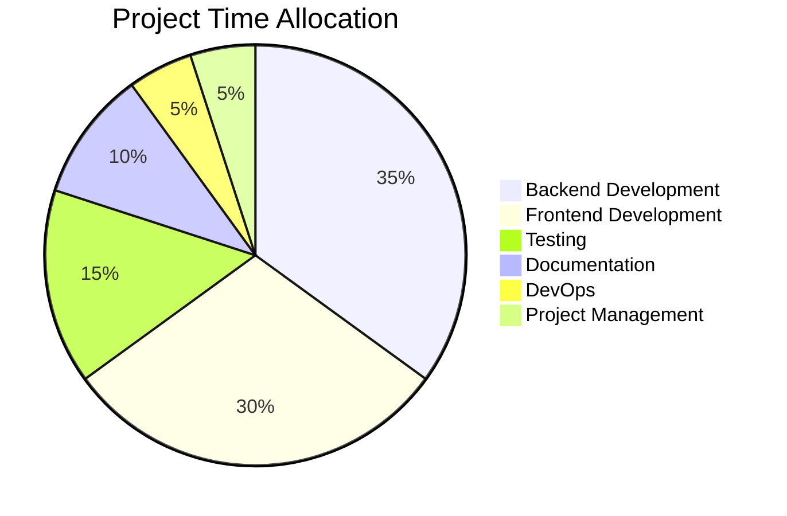

### Git Graph

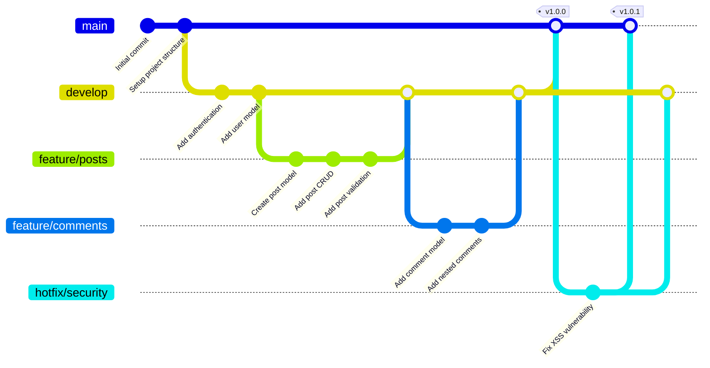

### Journey Map

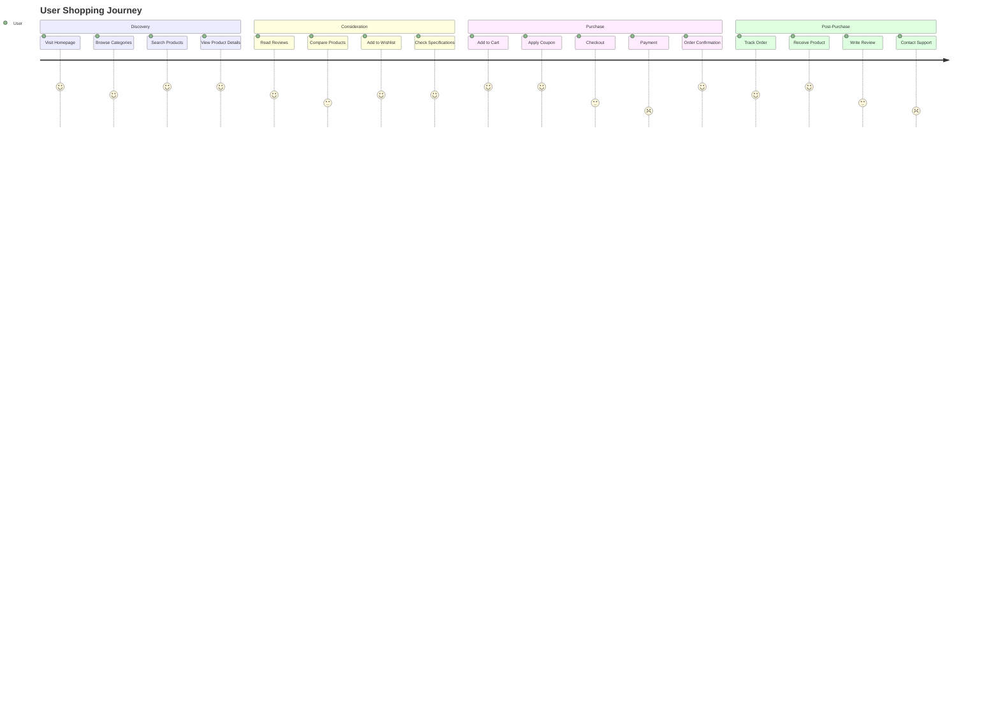

## PlantUML Diagrams

### Component Diagram

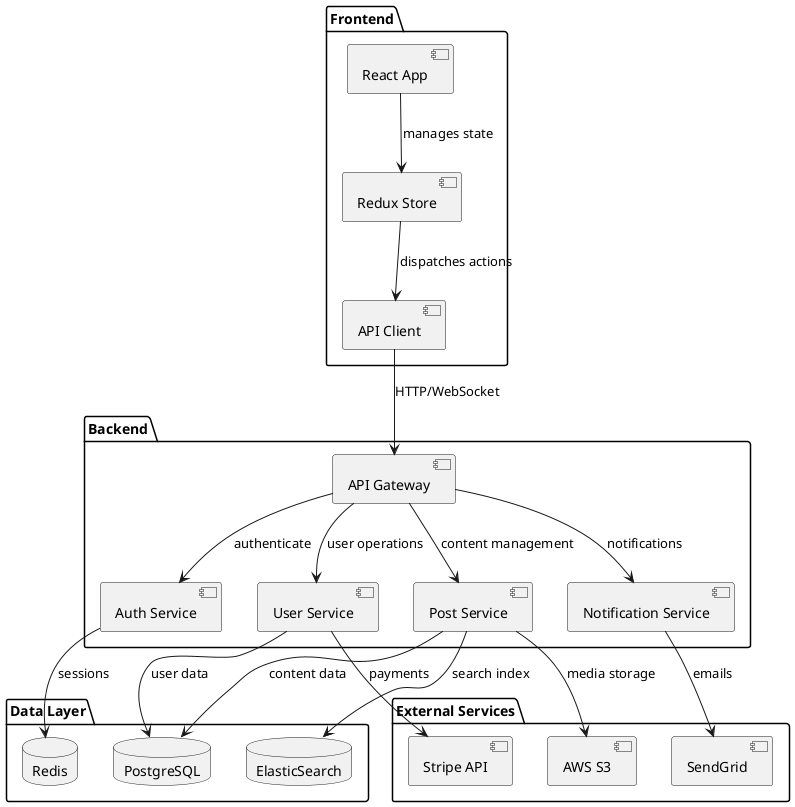

### Use Case Diagram

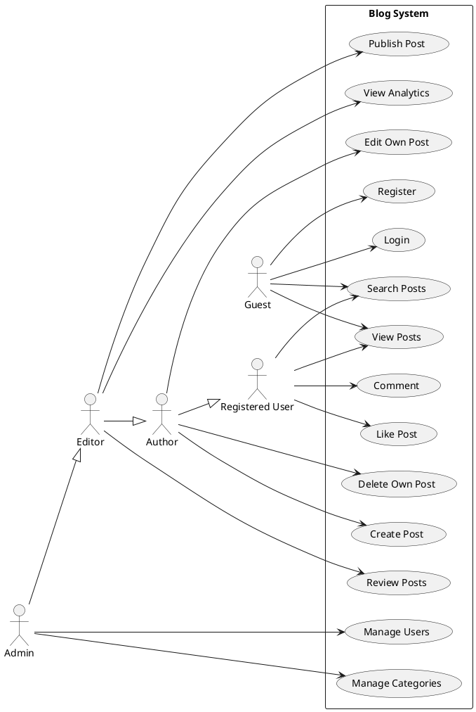

### Activity Diagram

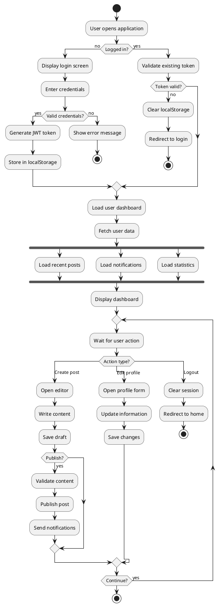

## Database Diagrams

### SQL Schema Definition

```sql
-- Users table
CREATE TABLE users (
    id UUID PRIMARY KEY DEFAULT gen_random_uuid(),
    email VARCHAR(255) UNIQUE NOT NULL,
    username VARCHAR(50) UNIQUE NOT NULL,
    password_hash VARCHAR(255) NOT NULL,
    first_name VARCHAR(100),
    last_name VARCHAR(100),
    avatar_url VARCHAR(500),
    bio TEXT,
    is_verified BOOLEAN DEFAULT FALSE,
    email_verified_at TIMESTAMP,
    created_at TIMESTAMP DEFAULT CURRENT_TIMESTAMP,
    updated_at TIMESTAMP DEFAULT CURRENT_TIMESTAMP,
    
    INDEX idx_email (email),
    INDEX idx_username (username),
    INDEX idx_created_at (created_at)
);

-- Posts table
CREATE TABLE posts (
    id UUID PRIMARY KEY DEFAULT gen_random_uuid(),
    user_id UUID NOT NULL,
    category_id UUID,
    title VARCHAR(255) NOT NULL,
    slug VARCHAR(255) UNIQUE NOT NULL,
    content TEXT NOT NULL,
    excerpt TEXT,
    featured_image VARCHAR(500),
    status ENUM('draft', 'published', 'archived') DEFAULT 'draft',
    view_count INTEGER DEFAULT 0,
    published_at TIMESTAMP,
    created_at TIMESTAMP DEFAULT CURRENT_TIMESTAMP,
    updated_at TIMESTAMP DEFAULT CURRENT_TIMESTAMP,
    deleted_at TIMESTAMP,
    
    FOREIGN KEY (user_id) REFERENCES users(id) ON DELETE CASCADE,
    FOREIGN KEY (category_id) REFERENCES categories(id) ON DELETE SET NULL,
    
    INDEX idx_user_id (user_id),
    INDEX idx_category_id (category_id),
    INDEX idx_slug (slug),
    INDEX idx_status_published (status, published_at),
    FULLTEXT INDEX idx_search (title, content)
);

-- Comments table with self-referencing for nested comments
CREATE TABLE comments (
    id UUID PRIMARY KEY DEFAULT gen_random_uuid(),
    post_id UUID NOT NULL,
    user_id UUID NOT NULL,
    parent_id UUID,
    content TEXT NOT NULL,
    is_approved BOOLEAN DEFAULT FALSE,
    created_at TIMESTAMP DEFAULT CURRENT_TIMESTAMP,
    updated_at TIMESTAMP DEFAULT CURRENT_TIMESTAMP,
    
    FOREIGN KEY (post_id) REFERENCES posts(id) ON DELETE CASCADE,
    FOREIGN KEY (user_id) REFERENCES users(id) ON DELETE CASCADE,
    FOREIGN KEY (parent_id) REFERENCES comments(id) ON DELETE CASCADE,
    
    INDEX idx_post_id (post_id),
    INDEX idx_user_id (user_id),
    INDEX idx_parent_id (parent_id)
);

-- Many-to-many relationship tables
CREATE TABLE post_tags (
    post_id UUID NOT NULL,
    tag_id UUID NOT NULL,
    attached_at TIMESTAMP DEFAULT CURRENT_TIMESTAMP,
    
    PRIMARY KEY (post_id, tag_id),
    FOREIGN KEY (post_id) REFERENCES posts(id) ON DELETE CASCADE,
    FOREIGN KEY (tag_id) REFERENCES tags(id) ON DELETE CASCADE
);

CREATE TABLE user_follows (
    follower_id UUID NOT NULL,
    following_id UUID NOT NULL,
    created_at TIMESTAMP DEFAULT CURRENT_TIMESTAMP,
    
    PRIMARY KEY (follower_id, following_id),
    FOREIGN KEY (follower_id) REFERENCES users(id) ON DELETE CASCADE,
    FOREIGN KEY (following_id) REFERENCES users(id) ON DELETE CASCADE,
    
    CHECK (follower_id != following_id)
);
```

### dbdiagram.io Syntax

```dbml
Project BlogDatabase {
  database_type: 'PostgreSQL'
  Note: 'Blog application database schema'
}

Table users {
  id uuid [pk, default: `gen_random_uuid()`]
  email varchar(255) [unique, not null]
  username varchar(50) [unique, not null]
  password_hash varchar(255) [not null]
  first_name varchar(100)
  last_name varchar(100)
  avatar_url varchar(500)
  bio text
  is_verified boolean [default: false]
  email_verified_at timestamp
  created_at timestamp [default: `now()`]
  updated_at timestamp [default: `now()`]
  
  Indexes {
    email [unique]
    username [unique]
    created_at
  }
}

Table posts {
  id uuid [pk, default: `gen_random_uuid()`]
  user_id uuid [not null, ref: > users.id]
  category_id uuid [ref: > categories.id]
  title varchar(255) [not null]
  slug varchar(255) [unique, not null]
  content text [not null]
  excerpt text
  featured_image varchar(500)
  status post_status [default: 'draft']
  view_count integer [default: 0]
  published_at timestamp
  created_at timestamp [default: `now()`]
  updated_at timestamp [default: `now()`]
  deleted_at timestamp
  
  Indexes {
    user_id
    category_id
    slug [unique]
    (status, published_at)
    (title, content) [type: fulltext]
  }
}

Table comments {
  id uuid [pk, default: `gen_random_uuid()`]
  post_id uuid [not null, ref: > posts.id]
  user_id uuid [not null, ref: > users.id]
  parent_id uuid [ref: > comments.id]
  content text [not null]
  is_approved boolean [default: false]
  created_at timestamp [default: `now()`]
  updated_at timestamp [default: `now()`]
  
  Indexes {
    post_id
    user_id
    parent_id
  }
}

Table categories {
  id uuid [pk, default: `gen_random_uuid()`]
  name varchar(100) [not null]
  slug varchar(100) [unique, not null]
  description text
  parent_id uuid [ref: > categories.id]
  sort_order integer [default: 0]
  created_at timestamp [default: `now()`]
  updated_at timestamp [default: `now()`]
  
  Indexes {
    slug [unique]
    parent_id
  }
}

Table tags {
  id uuid [pk, default: `gen_random_uuid()`]
  name varchar(50) [unique, not null]
  slug varchar(50) [unique, not null]
  created_at timestamp [default: `now()`]
  
  Indexes {
    name [unique]
    slug [unique]
  }
}

Table post_tags {
  post_id uuid [ref: > posts.id]
  tag_id uuid [ref: > tags.id]
  attached_at timestamp [default: `now()`]
  
  Indexes {
    (post_id, tag_id) [pk]
  }
}

Table likes {
  user_id uuid [ref: > users.id]
  post_id uuid [ref: > posts.id]
  created_at timestamp [default: `now()`]
  
  Indexes {
    (user_id, post_id) [pk]
  }
}

Table user_follows {
  follower_id uuid [ref: > users.id]
  following_id uuid [ref: > users.id]
  created_at timestamp [default: `now()`]
  
  Indexes {
    (follower_id, following_id) [pk]
  }
  
  Note: 'Self-referencing many-to-many relationship'
}

Enum post_status {
  draft
  published
  archived
}
```

## Timing Diagrams

### System Timing Diagram

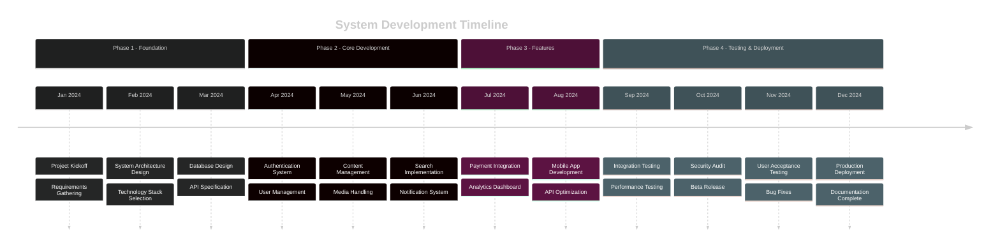

### Request/Response Timing

```
Client          API Gateway      Auth Service     Database        Cache
  |                 |                 |              |              |
  |--Request------->|                 |              |              |
  |                 |--Check Token--->|              |              |
  |                 |                 |--Validate--->|              |
  |                 |                 |<---User------|              |
  |                 |                 |--Store-------|------------->|
  |                 |<----Valid-------|              |              |
  |                 |--Get Data------|-------------->|              |
  |                 |                 |              |              |
  |                 |<----------------|--Data--------|              |
  |<---Response-----|                 |              |              |
  |                 |                 |              |              |

Time: 0ms         10ms              20ms           30ms          40ms
```

## Architecture Diagrams

### C4 Model - Context Diagram

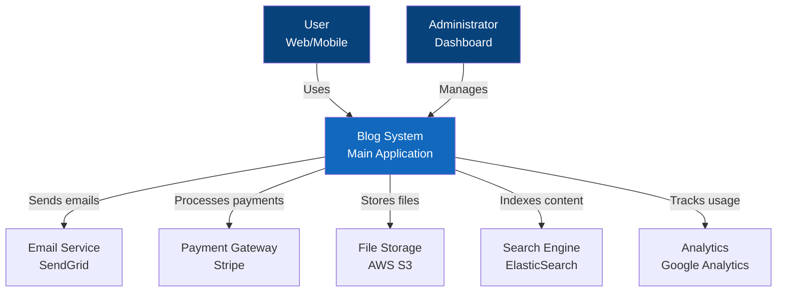

### Microservices Architecture

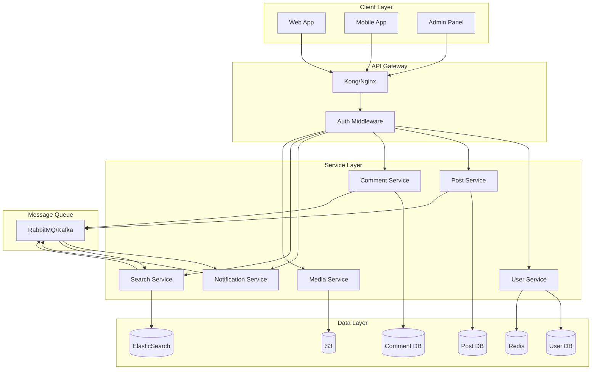

## Network Diagrams

### Infrastructure Diagram

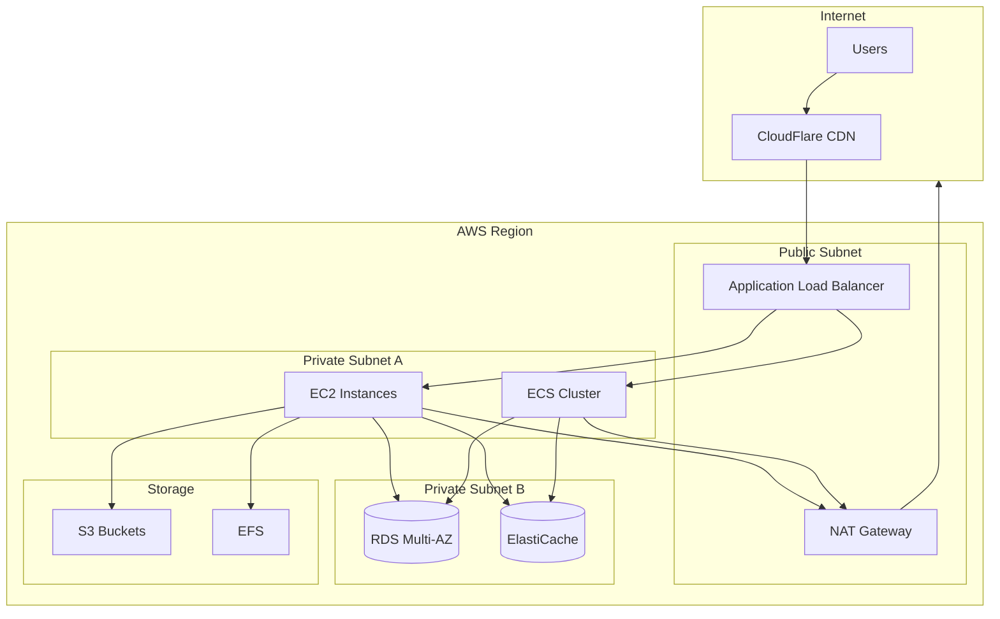

## Best Practices

### Diagram Guidelines

1. **Keep it Simple**: Start with high-level overviews
2. **Use Consistent Notation**: Stick to standard symbols
3. **Add Legends**: Explain symbols and colors
4. **Version Control**: Store diagrams as code
5. **Update Regularly**: Keep diagrams current
6. **Use Appropriate Tools**: Choose the right diagram type
7. **Consider Audience**: Technical vs non-technical
8. **Add Context**: Include notes and descriptions
9. **Maintain Hierarchy**: Show relationships clearly
10. **Review and Iterate**: Get feedback and improve

### Tool Selection

| Diagram Type | Best Tools | Use Case |
|-------------|------------|----------|
| ERD | dbdiagram.io, MySQL Workbench | Database design |
| UML | PlantUML, StarUML | Object-oriented design |
| Flowchart | Mermaid, Draw.io | Process flows |
| Sequence | Mermaid, PlantUML | API interactions |
| Architecture | C4 Model, Draw.io | System overview |
| Network | Draw.io, Visio | Infrastructure |
| Gantt | Mermaid, MS Project | Project timeline |
| State | Mermaid, PlantUML | State machines |

### Documentation Integration

```markdown
# System Documentation

## Architecture Overview
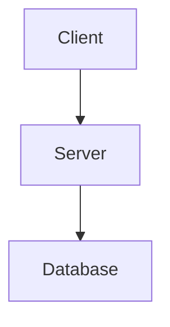

## API Flow
See [Sequence Diagram](#sequence-diagram) for detailed flow.

## Database Schema
Refer to [ERD](#entity-relationship-diagram) for relationships.
```

## Collaboration Tips

1. **Use Version Control**: Store diagram source files
2. **Automate Generation**: CI/CD pipeline for diagrams
3. **Embed in Documentation**: Keep diagrams with docs
4. **Share Links**: Use online tools for collaboration
5. **Export Formats**: Provide SVG/PNG for presentations
6. **Comment Code**: Reference diagrams in code
7. **Wiki Integration**: Link diagrams in project wiki
8. **Regular Reviews**: Schedule diagram updates
9. **Template Library**: Maintain reusable templates
10. **Training**: Ensure team knows tools